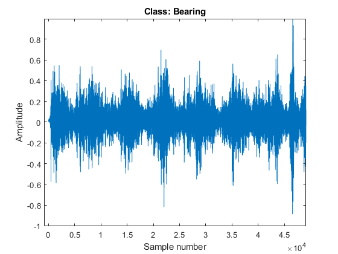
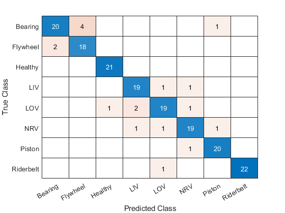
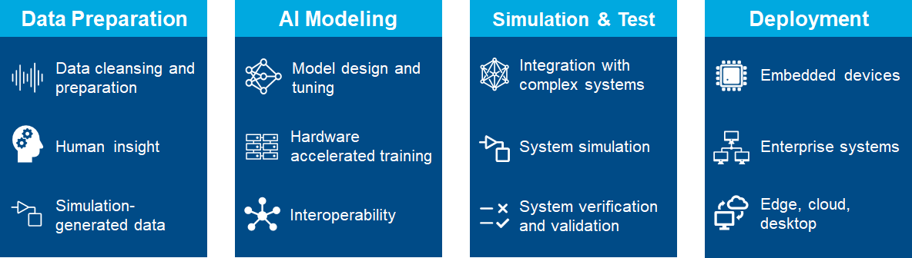

# Fault Detection Using LSTM Deep Learning Classification
This demo shows the full deep learning workflow for an example of signal data. We show how to prepare, model, and deploy a deep learning LSTM based classification algorithm to identify the condition or output of a mechanical air compressor.

We show examples on how to perform the following parts of the Deep Learning workflow:
- Part1 - Data Preparation
- Part2 - Modeling
- Part3 - Deployment

This demo is implemented as a MATLAB project and will require you to open the project to run it. The project will manage all paths and shortcuts you need. There is also a significant data copy required the first time you run the project.
## Part 1 - Data Preparation
This example shows how to extract the set of acoustic features that will be used as inputs to the LSTM Deep Learning network.
To run:
1. Open MATLAB project Aircompressorclassification.prj
2. Open and run Part01_DataPreparation.mlx
## Part 2 - Modeling
This example shows how to train LSTM network to classify multiple modes of operation that include healthy and unhealthy signals.
To run:
1. Open MATLAB project Aircompressorclassification.prj
2. Open and run Part02_Modeling.mlx
## Part 3 - Deployment
This example shows how to generate optimized c++ code ready for deployment. 

To run:
1. Open MATLAB project YAircompressorclassification.prj
1. Open MATLAB project Aircompressorclassification.prj
2. Open and run Part03_Deployment.mlx
