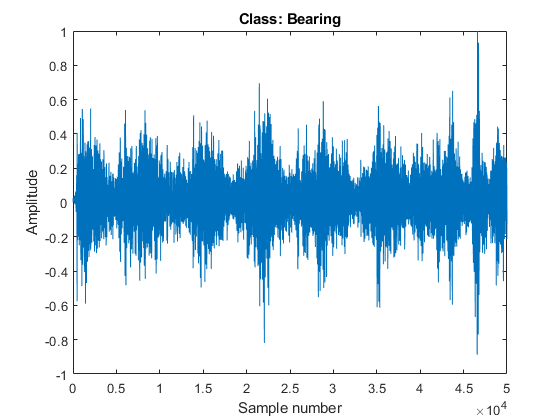
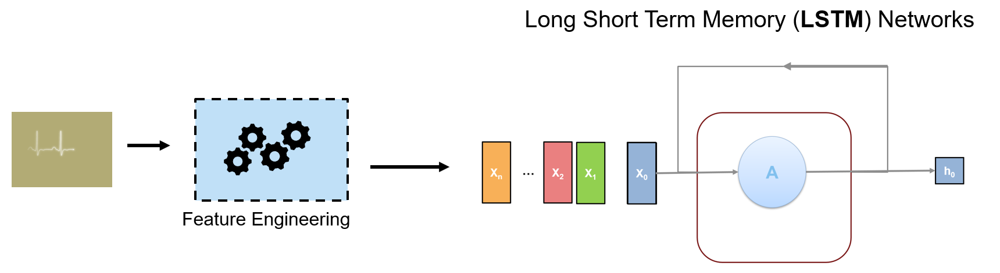

# Air Compressor Data Classification
# Part 1: Data Preparation


Copyright 2020 The MathWorks, Inc.


# Configuration


Click on the checkboxes below to choose options for how to run this script.


```matlab:Code
doFeatureExtraction = false; % if unchecked, this will save time by loading previous results
```


Make sure we run this as a project.


```matlab:Code
try
    prj = currentProject;
catch
    open("Aircompressorclassification.prj");
    OpenPart1;
    prj = currentProject;
end
```

# Create Datastore


The recorded data is sorted by subfolder. Each subfolder contains over 200 recordings of the labeled state. 


We create our datastore by providing the input data folder and specifying that the source of the labels is the name of the subfolders. 


```matlab:Code
dataFolder = 'AirCompressorData';
ads = audioDatastore(dataFolder,'IncludeSubfolders',true,'LabelSource','foldernames');
```


We then reset the random number generator (for consistent results) and shuffle the data.


```matlab:Code
rng(3);
ads = shuffle(ads);
```

# Split Into Training and Validation Sets


Split the data into training and validation by doing a 90% training, 10% validation split. The `countEachLabel` command will show us how many samples of data belong to each category in the dataset.


```matlab:Code
[adsTrain,adsValidation] = splitEachLabel(ads,0.9,0.1);
countEachLabel(adsTrain)
```

| |Label|Count|
|:--:|:--:|:--:|
|1|Bearing|203|
|2|Flywheel|203|
|3|Healthy|203|
|4|LIV|203|
|5|LOV|203|
|6|NRV|203|
|7|Piston|203|
|8|Riderbelt|203|


```matlab:Code
countEachLabel(adsValidation)
```

| |Label|Count|
|:--:|:--:|:--:|
|1|Bearing|22|
|2|Flywheel|22|
|3|Healthy|22|
|4|LIV|22|
|5|LOV|22|
|6|NRV|22|
|7|Piston|22|
|8|Riderbelt|22|

# Data Preparation
## Human Insight


The data we are working with are time-series recordings of acoustics from different parts of an air compressor. As such, there are strong relationships between samples in time.


```matlab:Code
sampleData = read(adsTrain);
sampleDataCategory = adsTrain.Labels(1);
plot(1:numel(sampleData), sampleData);
xlabel("Sample number");
ylabel("Amplitude");
title("Class: " + string(sampleDataCategory));
```





Listen to a sample of the audio if desired.


```matlab:Code
% sound(sampleData,16000);
```


Because of this, we should be able to use a type of recurrent neural network (RNN) as a model for the data. The type of RNN we will eventually select is a bi-directional long short term memory (LSTM) network. However, before we can get to modeling, it's important to prepare the data adequately. Oftentimes, it is best to transform or extract features from 1-dimensional signal data in order to increase a model's representative power, as we see in the diagram below:





In this part of the workflow, we will focus on how to engineer features from the original data that will aid in the model's ability to classify the inputs.


# Generate Training Features


The next step is to extract the set of acoustic features that will be used as inputs to the network. 


The Audio Toolbox provides a set of Spectral Descriptor features that are commonly used as inputs to deep learning networks.


We can extract the features with individual functions, or we can simplify the workflow and use a single object called audioFeatureExtractor to do it all at once. 


```matlab:Code
trainingFeatures = cell(1,numel(adsTrain.Files));
windowLength = 512;
overlapLength = 0;

aFE = audioFeatureExtractor('SampleRate',16e3, ...
    'Window',hamming(windowLength,'periodic'),...
    'OverlapLength',overlapLength,...
    'spectralCentroid',true, ...
    'spectralCrest',true, ...
    'spectralDecrease',true, ...
    'spectralEntropy',true,...
    'spectralFlatness',true,...
    'spectralFlux',false,...                
    'spectralKurtosis',true,...
    'spectralRolloffPoint',true,...
    'spectralSkewness',true,...
    'spectralSlope',true,...
    'spectralSpread',true);

if doFeatureExtraction
    reset(adsTrain);
    index = 1;
    tic;
    while hasdata(adsTrain)
        data = read(adsTrain);
        trainingFeatures{index} = extract(aFE,data);
        index = index + 1;
    end
    fprintf('Extraction took %f seconds.\n',toc);
else
    load("TrainingFeatures.mat");
    disp("Training data features loaded.")
end
```


```text:Output
Extraction took 31.829615 seconds.
```

# Normalize Training Features


Networks will often train better when normalized. Calculate the mean and standard deviation and normalize each element of the training feature set. 


```matlab:Code
allTrainingFeatures = cat(1,trainingFeatures{:});
M = mean(allTrainingFeatures);
S = std(allTrainingFeatures);

for index = 1:numel(adsTrain.Files)
   trainingFeatures{index} =  ((trainingFeatures{index} - M)./S).';
end
```

# Generate and Normalize Validation Features


Repeat the feature extraction for the validation features. Perform the normalization inside the loop.


```matlab:Code
validationFeatures = cell(1,numel(adsValidation.Files));

if doFeatureExtraction
    index = 1;
    tic;
    while hasdata(adsValidation)
       data = read(adsValidation);
       validationFeatures{index} = extract(aFE,data);
       validationFeatures{index} = ((validationFeatures{index}  - M) ./ S).';
       index = index + 1;
    end
    fprintf('Validation Extraction took %f seconds.\n',toc);
else
    load("ValidationFeatures.mat");
end
```


```text:Output
Validation Extraction took 3.328731 seconds.
```

