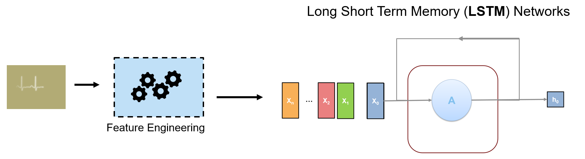
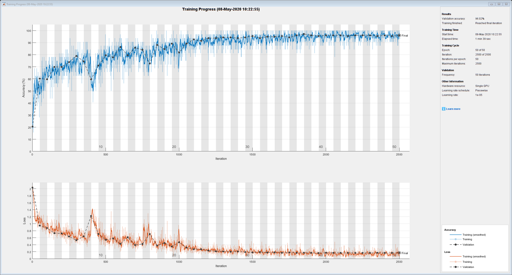
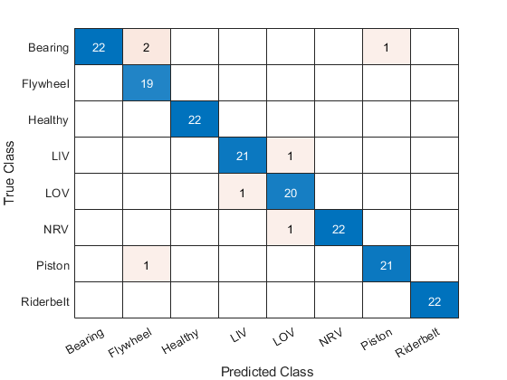
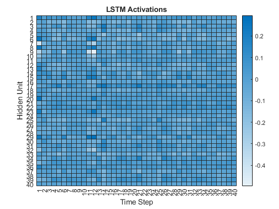

# Air Compressor Data Classification
# Part 2: Train and Evaluate a Model


Copyright 2020 The MathWorks, Inc.


# Configuration


Click on the checkboxes below to choose options for how to run this script.


```matlab:Code
doTraining = false;
doTesting = true;
```


Make sure we run this as a project.


```matlab:Code
try
    prj = currentProject;
catch
    open("Aircompressorclassification.prj");
    OpenPart2;
    prj = currentProject;
end
```

# Load Data


Load data that was preprocessed in the previous section.


```matlab:Code
load("TrainingFeatures.mat");
load("ValidationFeatures.mat");
reloadDatastore;
```

# Define Network


Now that we have extracted features from our signal, we will define a long short term memory (LSTM) deep neural network.





Use an LSTM network. An LSTM layer learns long-term dependencies between time steps of time series or sequence data. The first lstmlayer will have 100 hidden units and output the sequence data. Then a dropout layer will be used to reduce probability of overfitting. The second lstmlayer will output just the last step of the time sequence.


```matlab:Code
layers = [ ...
    sequenceInputLayer(size(trainingFeatures{1},1))
    lstmLayer(100,"OutputMode","sequence")
    dropoutLayer(0.1)
    lstmLayer(100,"OutputMode","last")
    fullyConnectedLayer(8)
    softmaxLayer
    classificationLayer];
```

# Define Network Hyperparameters

```matlab:Code
miniBatchSize = 32;
validationFrequency = floor(numel(trainingFeatures)/miniBatchSize);
options = trainingOptions("adam", ...
    "MaxEpochs",50, ...
    "MiniBatchSize",miniBatchSize, ...
    "Plots","training-progress", ...
    "Verbose",false, ...
    "Shuffle","every-epoch", ...
    "LearnRateSchedule","piecewise", ...
    "LearnRateDropFactor",0.1, ...
    "LearnRateDropPeriod",20,...
    'ValidationData',{validationFeatures,adsValidation.Labels}, ...
    'ValidationFrequency',validationFrequency);
```

# Train The Network


This network takes about 100 seconds to train on an NVIDIA RTX 2080 GPU.


```matlab:Code
if doTraining
    airCompNet = trainNetwork(trainingFeatures,adsTrain.Labels,layers,options); 
else
    load("TrainedModel.mat");
end
```




# Test The Network


Now that the network has been trained, we can test it on the validation data. 


```matlab:Code
if doTesting
    validationResults = classify(airCompNet,validationFeatures);
else
    load("ValidationResults.mat");
end
```


View the confusion chart for the test results:


```matlab:Code
cm = confusionchart(validationResults,adsValidation.Labels);
```





View the overall accuracy percentage of the validation and test results:


```matlab:Code
accuracy = sum(validationResults == adsValidation.Labels) / numel(validationResults);
disp("Accuracy: " + accuracy * 100 + "%")
```


```text:Output
Accuracy: 96.0227%
```

### Visualize LSTM Activations

\hfill \break


```matlab:Code
X = trainingFeatures{1};
sequenceLength = size(X,2);
idxLayer = 2;
features = zeros(100,sequenceLength);

if doTesting
    for i = 1:sequenceLength
        features(:,i) = cell2mat(activations(airCompNet,X(:,i),idxLayer));  
        [net, YPred(i)] = classifyAndUpdateState(airCompNet,X(:,i)); %#ok<SAGROW> 
    end
else
    load("LSTMActivations.mat");
end

```


Visualize the first 40 hidden units using a heatmap.


```matlab:Code
heatmap(features(1:40,1:40));
xlabel("Time Step")
ylabel("Hidden Unit")
title("LSTM Activations")
```




