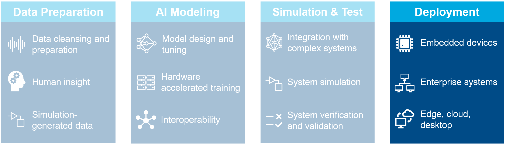
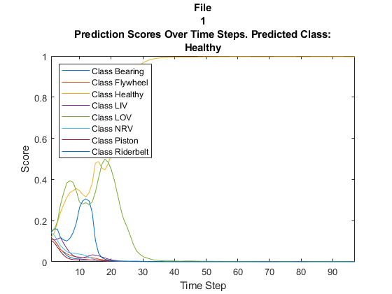
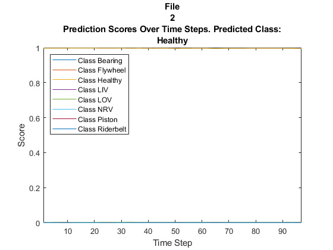
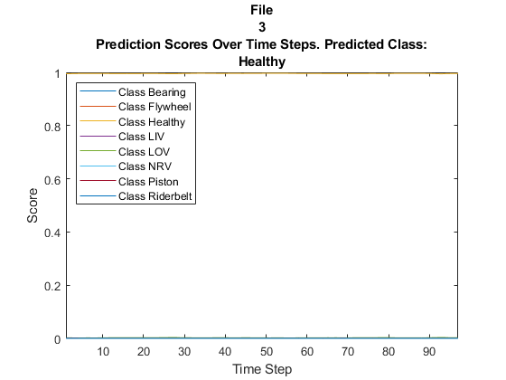
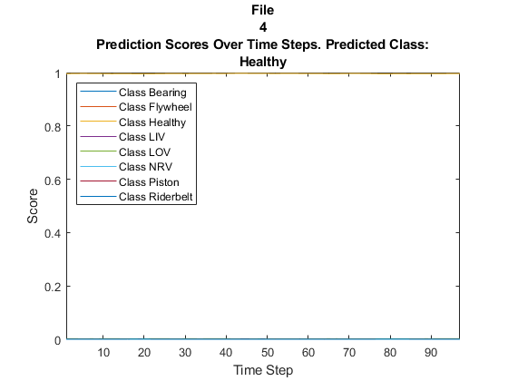
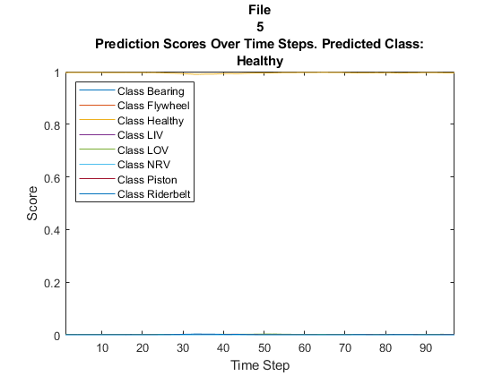

# Air Compressor Data Classification
# Part 3: Deployment


Copyright 2020 The MathWorks, Inc.





# Configuration


Click on the checkboxes below to choose options for how to run this script.


```matlab:Code
doCodeGeneration = false;
```


Make sure we run this as a project.


```matlab:Code
try
    prj = currentProject;
catch
    open("Aircompressorclassification.prj");
    OpenPart3;
    prj = currentProject;
end
```

# Load Data


Load data that was preprocessed in a previous section.


```matlab:Code
load("TrainingFeatures.mat");
load("ValidationFeatures.mat");
load("ValidationResults.mat");
load("Metrics.mat");
reloadDatastore;
```

# Deploying to Embedded System
## Create Functions to Process Data in a Streaming Loop


Once we have a trained network with satisfactory performance, it may be desirable to apply the network to test data in a streaming fashion. 


There are many additional considerations that must be taken into account to make the system work in real world embedded system. 


For example,


   -  The rate or interval at which classification can be performed with accurate results 
   -  The size of the network in terms of generated code (program memory) and weights (data memory) 
   -  The efficiency of the network in terms of computation speed 


In MATLAB, we can mimic how the network will be deployed when used in hardware on a real embedded system and begin to answer these important questions. 


## Streaming Feature Extraction


First, we will create a new function that does the feature extraction step in a streaming fashion. It will accept one frame of data and output the features for that frame. 


```matlab:Code
edit extractFeatures.m
```

## Combined Streaming Feature Extraction and Classification


Next, create a function that combines the feature extraction and deep learning classification. This is the function that we will generate code for.


```matlab:Code
edit streamingClassifier.m
```

# **Test Streaming Loop**


Next, we test our feature extraction function in a streaming loop. 


We will stream audio one frame at a time. This represents the system as it would be deployed in a real-time embedded system. We can measure the timing and accuracy of the streaming implementation. 


We'll streaming in an amount of data equivalent to five audio files. At the a time interval equal to each file we'll evaluate the output of the classifier. At the conclusion, we'll ensure that this classification result output matches the non-streaming test we did above. 


```matlab:Code
% Build a signal source using N audio files from the test set 
load('TrainedModel.mat')
clear functions;
resetState(airCompNet);
reset(adsValidation);
N = 5;
labels = categories(ads.Labels);
numLabels = numel(labels);

% Create a dsp.SignalSource so we can read the audio in a streaming fashion
hopLength = 512;
audioSource = dsp.SignalSource('SamplesPerFrame',hopLength);

% Label counter variable
j = 1;

% Pre-allocate array to store results
streamingResults = categorical(zeros(N,1));

% Create AudioLoopTimer object
framesPerFile = size(validationFeatures{1},2);
at = audioexample.AudioLoopTimer(framesPerFile*N,hopLength,16e3);

% BEGIN initialization time measurement
ticInit(at)

% Setup streaming loop 
while(j < N+1)

    % Read one audio file and put it in the source buffer
    data = read(adsValidation);
    release(audioSource);
    audioSource.Signal = data;
    
    % Setup feature vector
    features = zeros(size(validationFeatures{1}));
    
    % Setup scores vector
    scores = zeros(numLabels,framesPerFile);
        
    % Inner loop over frames
    for i = 1:framesPerFile
    
        ticLoop(at) % BEGIN loop timing measurement
        
        % Get a frame of audio data
        x = audioSource();
        
        % Apply streaming classifier function and store score
        [scores(:,i),features(:,i)] = streamingClassifier(x,M,S);
        
        tocLoop(at) % END loop timing measurement
    end
        
    % Store class result for that file
    [~, result] = max(scores(:,end), [], 1);
    streamingResults(j) = categorical(labels(result));
  
    % Plot scores to compare over time
    classNames = string(airCompNet.Layers(end).Classes);
    figure;
    lines = plot(scores'); %#ok<*NASGU> 
    xlim([1 framesPerFile])
    legend("Class " + classNames,'Location','northwest')
    xlabel("Time Step")
    ylabel("Score")
    str = ["File" j "Prediction Scores Over Time Steps. Predicted Class:" char(streamingResults(j))];
    title(str);
    
    j = j + 1;
end
```
















  
### Measure Accuracy of Streaming Test


We can now look at the test results for the streaming version of the classifier and the non-streaming. They should be identical. 


```matlab:Code
testError = mean(validationResults(1:N) ~= streamingResults);
disp("Error between streaming classifier and non-streaming: " + testError*100 + "%")
```


```text:Output
Error between streaming classifier and non-streaming: 0%
```

## Generate Code for ARM Cortex-A using MATLAB Coder Support Package


Now we can create a code generation configuration for our function. We will generate code using the ARM Compute Library to produce code that can be deployed to a Raspberry Pi or another type of ARM Cortex-A device.


Requires MATLAB Coder Interface for Deep Learning Libraries Support Package. 


Create a configuration object for a library:


```matlab:Code
if doCodeGeneration
    cfg = coder.config('lib');
    cfg.GenCodeOnly = true;
    cfg.GenerateMakefile = false;
    cfg.TargetLang = 'C++';
    dlcfg = coder.DeepLearningConfig('arm-compute');
    dlcfg.ArmArchitecture = 'armv7';
    dlcfg.ArmComputeVersion = '19.02';
    cfg.DeepLearningConfig = dlcfg;
    cfg.HardwareImplementation.ProdHWDeviceType = 'ARM Compatible->ARM Cortex';
```


Generate code:


```matlab:Code
    codegen -config cfg streamingClassifier -args {single(ones(256,1)),single(ones(1,10)),single(ones(1,10))} -d arm_compute -report
    OpenCodegenReport
else
    OpenCodegenReport
end
```


```text:Output
Warning: Removed 'D:\work\aircompressorclassification\arm_compute\interface' from the MATLAB path for this MATLAB session.
	See 'doc path' for more information.
Warning: Removed 'D:\work\aircompressorclassification\arm_compute\examples' from the MATLAB path for this MATLAB session.
	See 'doc path' for more information.
Warning: Removed 'D:\work\aircompressorclassification\arm_compute\html' from the MATLAB path for this MATLAB session.
	See 'doc path' for more information.
Code generation successful: View report
```

